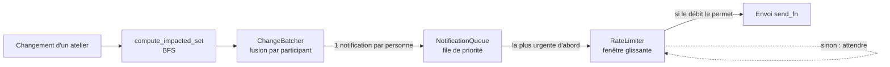

# Propagation d'impact et notification optimisée

Projet Simulated (Epitech Mobile). Python, sans dépendance d'exécution : `pytest` et `ruff` ne servent qu'au développement.

## Le problème

Dans un événement avec plusieurs ateliers, quand l'organisateur change un horaire, une salle ou annule un atelier, il faut prévenir **uniquement les personnes réellement concernées**, dans le **bon ordre**, **sans dépasser le débit** de l'API d'envoi, et **sans envoyer trois messages contradictoires** si l'organisateur change trois fois d'avis en deux minutes.

## Ce que fait le programme

| Question | Réponse | Module |
|---|---|---|
| Qui est impacté ? | Parcours de graphe (BFS) qui suit les dépendances entre ateliers | `src/impact.py` |
| Quoi leur dire ? | Fusion des changements rapprochés : une notification cohérente par personne | `src/batching.py` |
| Dans quel ordre ? | File de priorité : annulation, puis changement d'horaire, puis info mineure | `src/notifications.py` |
| À quel rythme ? | Limiteur de débit à fenêtre glissante : jamais plus de N envois par période | `src/rate_limiter.py` |

L'envoi réel (SMS, email, push) est **simulé** : `send_fn` est un point d'extension où brancher un vrai appel d'API.

## Installation

Python 3.10 ou plus (testé en 3.12).

```bash
git clone https://github.com/TimotheeO/NOM_DU_REPO.git
cd NOM_DU_REPO
python3 -m venv venv
source venv/bin/activate        # sous Windows : le script activate de venv/Scripts
pip install -r requirements.txt
```

## Utilisation

### 1. Simuler des changements (CLI)

Le temps est **simulé** : une simulation de plusieurs minutes s'affiche instantanément.

```bash
python3 cli.py                                   # scénario de démonstration
python3 cli.py --list                            # ateliers et participants disponibles
python3 cli.py --change 0 w1 horaire 15h         # un seul changement
python3 cli.py --change 0 w1 horaire 15h --change 5 w1 horaire 16h --change 12 w1 salle B
python3 cli.py --limit 1 --window 10             # autre débit, autre fenêtre
```

Un changement s'écrit `--change HEURE ATELIER CHAMP VALEUR` (heure en secondes depuis le début, atelier = identifiant donné par `--list`). L'urgence est déduite : champ `statut` avec la valeur `annulé` = annulation, champ `horaire` = changement d'horaire, sinon info mineure.

| Option | Rôle | Défaut |
|---|---|---|
| `--change H A C V` | Un changement (répétable) | scénario de démo |
| `--window` | Fenêtre de regroupement, en secondes | 30 |
| `--limit` | Nombre maximal d'envois par période | 2 |
| `--period` | Durée de la période du limiteur, en secondes | 1 |
| `--data` | Fichier JSON de l'événement | `data/sample_event.json` |
| `--rows` | Lignes affichées pour l'ordre d'envoi | 15 |
| `--list` | Liste ateliers et participants, puis quitte | |

La CLI affiche quatre étapes : **1.** qui est impacté (BFS), **2.** la fusion des changements, **3.** l'ordre d'envoi, **4.** le respect du débit. Extrait du scénario de démonstration (l'ordre entre deux personnes de même urgence peut varier d'une exécution à l'autre) :

```
Bilan : 11 notifications sans fusion -> 5 émises (6 évitées)

ÉTAPE 3/4 - ORDRE D'ENVOI  (file de priorité : urgent d'abord)
  t=  30.0s  ANNULATION          p5   Atelier Poterie : annulé
  t=  30.0s  ANNULATION          p4   Atelier Poterie : annulé
  t=  31.0s  CHANGEMENT_HORAIRE  p3   Atelier Cuisine : horaire → 16h, salle → B
  t=  31.0s  CHANGEMENT_HORAIRE  p2   Atelier Cuisine : horaire → 16h, salle → B
  t=  32.0s  CHANGEMENT_HORAIRE  p1   Atelier Cuisine : horaire → 16h, salle → B

ÉTAPE 4/4 - DÉBIT  (rate limiting)
  t=   0.0s │ ██ 2/2
  t=   1.0s │ ██ 2/2
  t=   2.0s │ █ 1/2
  Maximum observé sur une fenêtre : 2 (limite 2) -> OK
```

### 2. Lancer les tests

```bash
python3 -m pytest        # 92 tests, avec affichages visuels
ruff check .             # style du code (contrôlé aussi par la CI)
```

`pytest.ini` active `-v -rP` : un nom par test, et les affichages des tests réussis (histogrammes, rapports de fusion) sont montrés.

### 3. Autres démos

```bash
python3 demo.py w1            # qui est impacté si l'atelier w1 change (BFS seul)
python3 demo_pipeline.py      # fusion puis envoi, puis 120 notifications à 5 par seconde
```

## Architecture



```
├── cli.py                     CLI de démonstration
├── demo.py, demo_pipeline.py  démos
├── data/sample_event.json     événement de test (5 personnes, 4 ateliers)
├── src/
│   ├── graph.py               modèle du graphe (participants, ateliers, dépendances)
│   ├── data_loader.py         JSON -> graphe
│   ├── impact.py              BFS : qui est impacté
│   ├── batching.py            fusion des changements rapprochés
│   ├── notifications.py       niveaux d'urgence + file de priorité (heapq)
│   ├── rate_limiter.py        limiteur de débit
│   ├── dispatcher.py          file de priorité + limiteur -> envoi
│   ├── simulation.py          simulation de bout en bout sur une ligne de temps
│   ├── clock.py               horloge simulée
│   └── report.py, batching_report.py, impact_report.py   affichages
├── tests/                     un fichier de tests par module + conftest.py
└── docs/                      SCHEMA.md (graphe), PIPELINE.md (chaîne), SOUTENANCE.md
```

Choix principaux :

- **Graphe orienté en ensembles** : test d'appartenance en O(1), pas de doublon possible. Un changement sur un atelier impacte ceux qui en dépendent, pas l'inverse.
- **BFS avec `deque` et ensemble `visited`** : O(W + E + P), gère cycles et chemins multiples.
- **`heapq` + `IntEnum`** : ajout et retrait en O(log n) ; l'annulation vaut 0 car `heapq` sort le plus petit.
- **Fenêtre glissante plutôt que token bucket** : garantit strictement « jamais plus de N envois sur n'importe quelle période », sans rafale.
- **Fusion par participant, fenêtre fixe** : la dernière valeur gagne, une annulation remplace les autres changements du même atelier, l'urgence finale est la plus haute.
- **Horloge injectée** : les tests couvrent des minutes de simulation en quelques millisecondes, de façon déterministe.

## Tests

92 tests, un fichier par module :

| Fichier | Tests | Couvre |
|---|---|---|
| `test_graph.py`, `test_data_loader.py` | 5 | Modèle du graphe, chargement JSON |
| `test_impact.py` | 7 | Cascade, doublons, cycles, gros graphe |
| `test_notifications.py` | 5 | Ordre de sortie par urgence |
| `test_rate_limiter.py`, `test_dispatcher.py` | 22 | Débit jamais dépassé (jusqu'à 400 notifications) |
| `test_batching.py` | 18 | Fusion, fenêtre configurable, annulation |
| `test_clock.py` | 5 | Horloge simulée |
| `test_simulation.py` | 14 | Ordonnanceur, changement tardif, priorité |
| `test_cli.py` | 15 | Sorties, erreurs, script exécutable |
| `test_pipeline.py` | 1 | Chaîne complète |

Le débit est contrôlé par un vérificateur **indépendant** (`max_in_any_window`) qui recompte les envois sans connaître le limiteur. Le code a aussi été cassé volontairement (limiteur, fusion, ordonnanceur) pour vérifier que les tests deviennent rouges.

## Limites connues

- **L'urgence n'accélère pas l'émission** : une annulation attend la fin de sa propre fenêtre de regroupement. Essayer : `python3 cli.py --change 0 w1 horaire 15h --change 15 w3 statut annulé` montre l'annulation partant après le changement d'horaire. Piste : émettre immédiatement les annulations.
- **L'ordonnanceur n'existe que dans la simulation** : en production, un minuteur devrait appeler `flush_ready()`.
- Envoi simulé, sans réessai ; état en mémoire ; pas de gestion de la concurrence entre threads.
