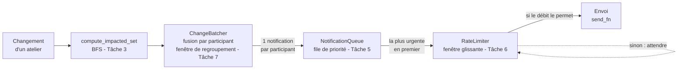

# Chaîne de notification (Cycle 2)

## Vue d'ensemble



## Rôle de chaque module

| Module | Rôle | Tâche |
|---|---|---|
| `src/graph.py` | Modèle du graphe (participants, ateliers, dépendances) | 1 |
| `src/data_loader.py` | Charge un événement depuis un JSON | 2 |
| `src/impact.py` | Calcule qui est impacté (BFS) | 3 |
| `src/notifications.py` | File de priorité (`heapq`), niveaux d'urgence | 5 |
| `src/rate_limiter.py` + `src/dispatcher.py` | Limite le débit et envoie | 6 |
| `src/batching.py` | Fusionne les changements rapprochés | 7 |
| `src/clock.py` | Horloge simulée (tests rapides et déterministes) | 6, 7 |
| `src/report.py` | Affichages + vérificateur indépendant du débit | 6, 7 |

## Règles de fusion (Tâche 7)

- Même atelier + même champ modifié plusieurs fois : **la dernière valeur gagne**
- Atelier annulé : l'annulation **remplace** ses autres changements
- Urgence finale : la **plus haute** parmi les changements restants
- Fenêtre fixe démarrée au **premier** changement (délai maximal borné)

## Lancer

```
python3 -m pytest          # tests + affichages
python3 demo_pipeline.py   # démo visuelle
```
