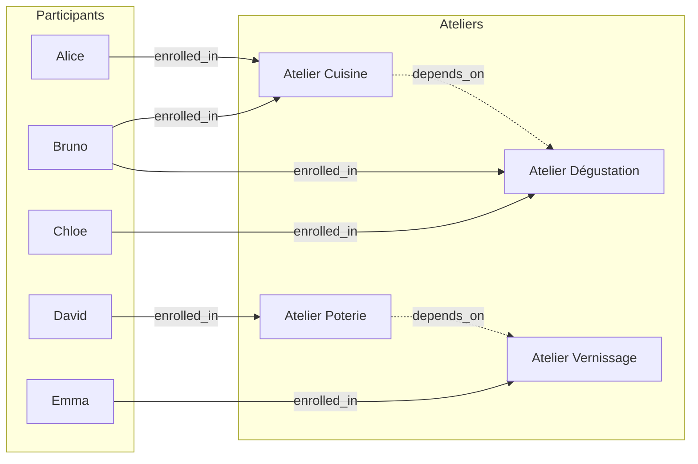

# Schéma du graphe de dépendances

## Concept

L'événement est modélisé comme un **graphe** :

- **Noeuds** :
  - `Participant` — une personne inscrite à l'événement
  - `Workshop` — un atelier / sous-groupe de l'événement
- **Arêtes** :
  - `enrolled_in` — un `Participant` est inscrit à un `Workshop`
  - `depends_on` — un `Workshop` dépend d'un autre `Workshop`
    (ex : même intervenant, même salle → si l'un change, l'autre est impacté)

## Exemple (jeu de données `data/sample_event.json`)

## Pourquoi ce modèle ?

Quand l'atelier **Cuisine (w1)** change de créneau :
1. Les participants directement inscrits à w1 sont impactés (Alice, Bruno)
2. L'atelier **Dégustation (w2)** dépend de w1 → il est impacté aussi
3. Donc les participants de w2 (Bruno déjà compté, Chloe) sont impactés en cascade

C'est exactement ce que l'algorithme de parcours de graphe (BFS/DFS, Tâche 3)
devra calculer automatiquement : partir de `w1`, suivre les arêtes
`depends_on` en cascade, et collecter tous les participants concernés
sans doublons.
